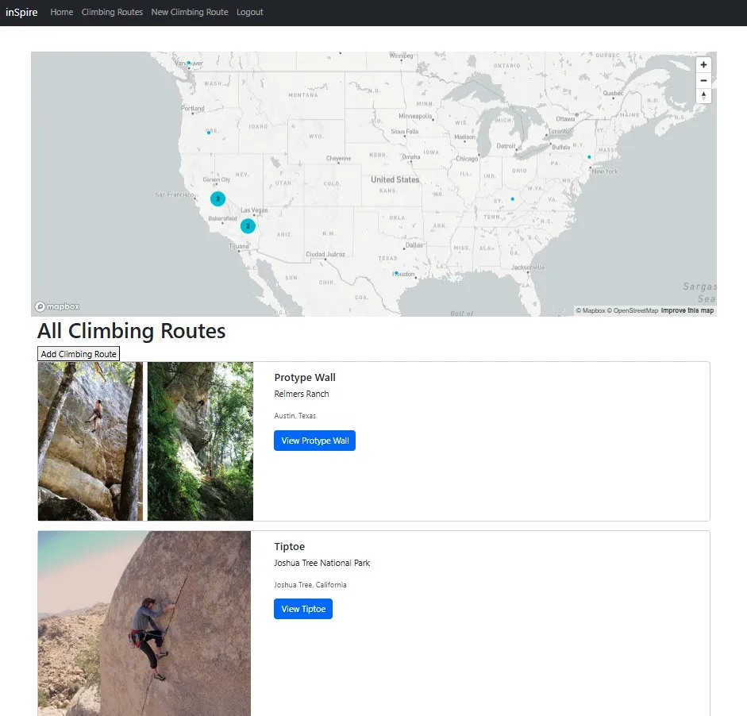
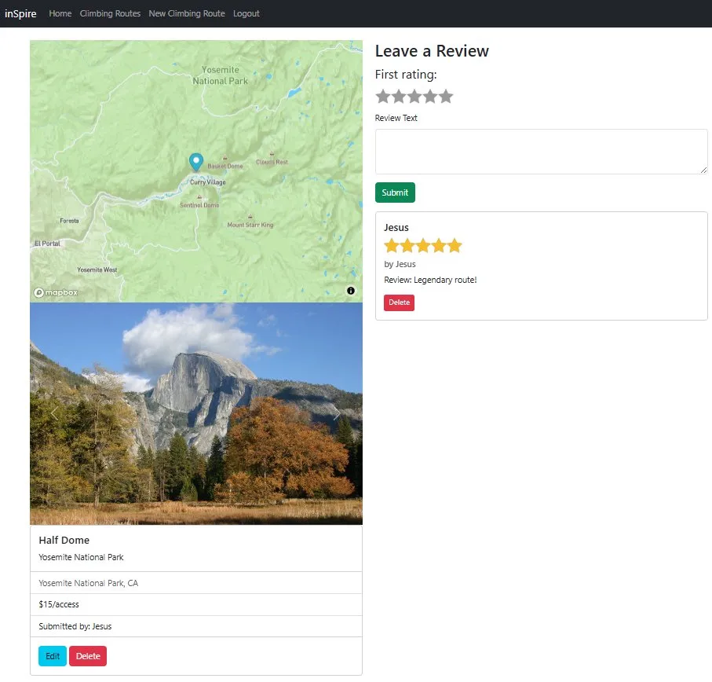

# inSpire

A full-stack web application for discovering, sharing, and reviewing climbing routes around the world.
Users can browse routes on an interactive map, create accounts, post their own routes with photos, and leave reviews on others.

> Built with Node.js, Express, and MongoDB.

---

## Live Demo

**[https://inspire-climbing-67b5b17b2259.herokuapp.com/](https://inspire-climbing-67b5b17b2259.herokuapp.com/)**

> Hosted on Heroku Eco

---

## Screenshots

### Home page


### Browse climbing routes
Routes are clustered geographically on an interactive Mapbox map.


### Route details
Each route shows photos, location, and community reviews.


---

## Features

- **User authentication** — register, log in, and log out with sessions persisted in MongoDB (Passport.js + passport-local)
- **Interactive maps** — every route is geocoded and displayed on a Mapbox map; the index page shows a clustered map of all routes
- **Full CRUD for climbing routes** — authors can create, edit, and delete their own routes
- **Multi-image uploads** — images are stored in Cloudinary, with thumbnail generation and the ability to delete individual images on edit
- **Reviews and ratings** — authenticated users can leave star ratings and comments on any route
- **Authorization** — users can only edit or delete content they created
- **Flash messages** — success and error feedback after actions
- **Security hardening** — Helmet for HTTP headers + Content Security Policy, sanitization against NoSQL injection, sanitize-html on user input, secure session cookies
- **Centralized error handling** with custom `ExpressError` class and async wrapper

---

## Tech Stack

**Backend**
- Node.js + Express 5
- MongoDB + Mongoose
- Passport.js (passport-local-mongoose) for authentication
- express-session + connect-mongo for session storage
- Joi for server-side validation
- Helmet, express-mongo-sanitize, sanitize-html for security

**Frontend**
- EJS templating with ejs-mate layouts
- Bootstrap 5
- Mapbox GL JS for interactive maps
- Custom client-side form validation

**Cloud Services**
- MongoDB Atlas — database hosting
- Cloudinary — image storage and transformations
- Mapbox — geocoding and map rendering

---

## Getting Started

### Prerequisites

- [Node.js](https://nodejs.org/) (v18 or higher recommended)
- A [MongoDB Atlas](https://www.mongodb.com/atlas) account (or local MongoDB install)
- A [Cloudinary](https://cloudinary.com/) account (free tier works)
- A [Mapbox](https://www.mapbox.com/) account for an access token

### Installation

1. **Clone the repository**
   ```bash
   git clone https://github.com/ariasje1/inSpire.git
   cd inSpire
   ```

2. **Install dependencies**
   ```bash
   npm install
   ```

3. **Set up environment variables**

   Copy `.env.example` to `.env` and fill in your own credentials:
   ```bash
   cp .env.example .env
   ```

   See [Environment Variables](#-environment-variables) below for what each one does.

4. **Start the server**
   ```bash
   npm start
   ```

   The app will be running at `http://localhost:3000`.

---

## Environment Variables

The app reads these from a `.env` file at the project root:

| Variable | Description |
| --- | --- |
| `DB_URL` | MongoDB connection string (Atlas or local). Falls back to `mongodb://localhost:27017/inSpire` if not set. |
| `SECRET` | Secret used to sign session cookies and encrypt session data |
| `CLOUDINARY_CLOUD_NAME` | Your Cloudinary cloud name |
| `CLOUDINARY_KEY` | Cloudinary API key |
| `CLOUDINARY_SECRET` | Cloudinary API secret |
| `MAPBOX_TOKEN` | Mapbox public access token (used for geocoding and map tiles) |
| `PORT` | Port the server listens on (defaults to `3000`) |

---

## Project Structure

```
inSpire/
├── app.js                  # Main Express app — middleware, routes, error handling
├── middleware.js           # Custom middleware (auth, validation, ownership)
├── schemas.js              # Joi validation schemas
├── README.md
├── package.json
├── package-lock.json
├── cloudinary/
│   └── index.js            # Cloudinary + multer storage config
├── controllers/
│   ├── climbRoutes.js
│   ├── reviews.js
│   └── users.js
├── models/
│   ├── climbRoute.js
│   ├── review.js
│   └── user.js
├── routes/
│   ├── climbRoutes.js
│   ├── reviews.js
│   └── users.js
├── views/
│   ├── climbRoutes/        # edit, index, new, show
│   ├── users/              # login, register
│   ├── partials/           # navbar, flash, footer
│   ├── layout/             # boilerplate.ejs
│   ├── home.ejs            # Landing page
│   ├── error.ejs           # Error page
│   └── notfound.ejs        # 404 page
├── public/
│   ├── javascripts/        # clusterMap, showPageMap, validateForms
│   └── stylesheets/        # app, home, stars
├── utils/
│   ├── catchAsync.js
│   ├── ExpressError.js
│   └── mongoSanitizeV5.js
└── seeds/
    ├── cities.js
    ├── index.js
    └── seedHelpers.js
```


Built by **Jesus Arias**. Feel free to open an issue or reach out with questions or feedback.
